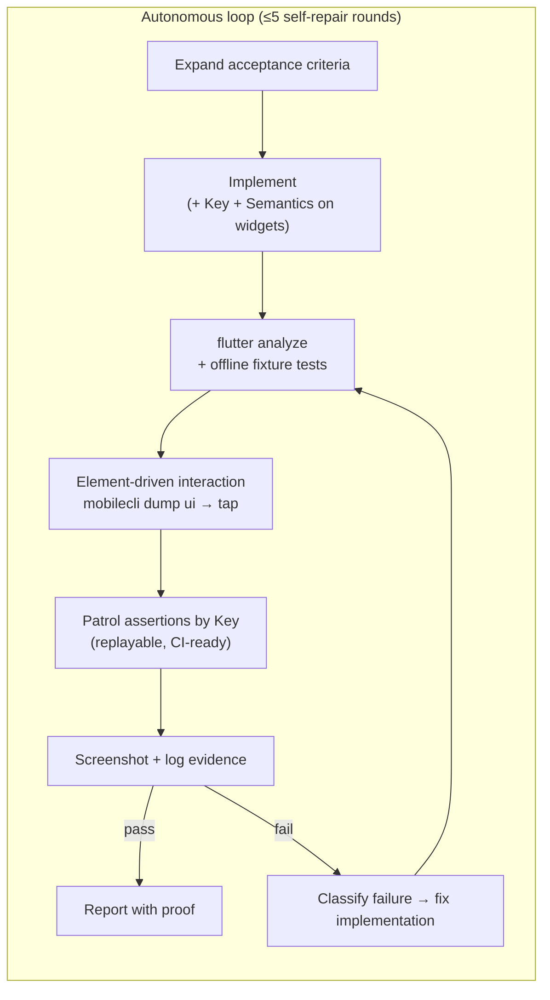

# flutter-autonomous

> An [Agent Skill](https://agentskills.io) that turns Claude Code into an autonomous Flutter engineer: it runs your app on a **real device or simulator**, taps and reads the screen like a human, and drives the full **implement → test → fix** loop unattended — **iOS and Android at parity**.

[](https://skills.sh/z-chu/flutter-autonomous-skill)
[](LICENSE)
[](#platform-support)
[](https://code.claude.com/docs/en/skills)

**[中文文档 →](README.zh-CN.md)**（含小白从零上手教程）

---

## Why this exists

Every AI coding agent hits the same wall with Flutter: the app renders to a **Skia/Impeller canvas**, so the OS accessibility tree is nearly **empty by default**. Generic mobile automation ("list elements, tap the button") sees a blank screen, and agents degrade into guessing blind tap coordinates off screenshots — slow, fragile, and wrong.

This skill encodes the way out, learned from real unattended runs:

1. **Expose `Semantics` labels in code** → `mobilecli dump ui` suddenly lists every widget **with device-pixel rects** → tap centers precisely, no guessing. The skill treats "widget not listable" as a **code defect to fix**, not a reason to fall back to blind taps.
2. **Assert with Patrol by `Key`** over the Dart VM — the only deterministic, replayable, CI-ready assertion path that works on both platforms regardless of the accessibility tree.
3. **Prove pure logic offline first** with second-fast fixture tests — device time is spent only on what only a device can prove.

Plus the operational knowledge that makes long unattended runs actually survive: environment self-bootstrap, hot-reload discipline (`USR1`/`USR2` signals instead of cold restarts), foreground-app verification to avoid cross-app contamination, evidence-based completion ("ran the command" ≠ "achieved the result"), and a ≤5-round self-repair cap with structured stuck reports.

## Quick start

### 1. Install the skill (pick one)

```bash
# A. skills CLI (community standard, works across 70+ agents; -g = user-wide)
npx skills add z-chu/flutter-autonomous-skill -g

# B. One-liner (clones the repo and symlinks into ~/.claude/skills)
curl -fsSL https://raw.githubusercontent.com/z-chu/flutter-autonomous-skill/main/install.sh | bash

# C. Manual
git clone https://github.com/z-chu/flutter-autonomous-skill.git
cd flutter-autonomous-skill && bash install.sh
```

Or as a Claude Code plugin:

```
/plugin marketplace add z-chu/flutter-autonomous-skill
/plugin install flutter-autonomous@flutter-autonomous-skill
```

Restart Claude Code afterwards — skills are discovered on startup. No manual enabling: the skill auto-triggers whenever you ask for anything like *"run the app on a device and verify X"*.

### 2. Bootstrap the environment (once per machine)

```bash
bash ~/.claude/skills/flutter-autonomous/scripts/bootstrap.sh
```

Idempotent detect → install → re-verify for every dependency (`mobilecli`, `patrol_cli`, `adb`, Xcode CLT, node…). On Linux it automatically skips the iOS toolchain and runs Android-only. Anything it can't auto-install, it prints the exact command for.

### 3. Wire up your Flutter project (once per project)

```bash
bash ~/.claude/skills/flutter-autonomous/setup-project.sh /path/to/your/flutter-app
```

Installs into your project: a `CLAUDE.md` "constitution" (package ids auto-detected and filled in), a permission allowlist + auto format/analyze hooks, and five slash commands. Never overwrites existing files — conflicts are placed alongside for manual merge.

### 4. Put it to work

```
/spec  add a dark-mode toggle to Settings          # expand acceptance criteria first, you confirm
/ship  add a dark-mode toggle to Settings          # fully autonomous: implement → verify → report
/verify                                            # verify current changes with the hardest evidence
/debug patrol test fails with "found 0 widgets"    # root-cause a failure
/nightly <paste a task checklist>                  # overnight queue, read the report in the morning
```

Or skip the commands and just talk: *"Run the app on the simulator and check that login error states render correctly."*

## How it works



**Four verification layers** — always the hardest evidence for the change type:

| Layer | Proves | Cost |
|---|---|---|
| ① Offline fixture tests | Pure logic: parsing, math, state machines, error handling | seconds, no device |
| ② Element-driven interaction | Taps, navigation, rendered data (one-off) | fast, on device |
| ③ Patrol by `Key` | Replayable regression assertions, pass/fail for CI | on device |
| ④ Logs & screenshots | Connections/state machines (logs beat screenshots); visual layout | forensic |

**One interaction substrate.** iOS (WebDriverAgent / `xcrun simctl`) and Android (`adb`) differences are absorbed by [`mobilecli`](https://github.com/mobile-next/mobilecli) — the skill's playbooks are written once and run on both. Platform edge cases live in [`references/ios.md`](skills/flutter-autonomous/references/ios.md) and [`references/android.md`](skills/flutter-autonomous/references/android.md).

**Hard rules, not vibes.** The skill ships an explicit Always/Never contract: never guess element names (inspect first), never weaken a test to make it pass, never claim "done" without independent re-verification, never stop for anything self-fixable — and red-line operations (real money, secrets/credentials, irreversible destruction) are **denied by default** — unlocked only by your explicit upfront authorization, with unattended runs skipping and flagging unauthorized items instead of hanging; a physically offline device is the one hard stop.

## What's inside

```
skills/flutter-autonomous/
├── SKILL.md                 # the methodology Claude loads (bootstrap, element-driven
│                            # interaction, 4-layer verification, failure decision tree, hard rules)
├── scripts/
│   ├── bootstrap.sh         # cross-platform environment self-bootstrap (idempotent)
│   └── tap-by-label.sh      # tap a Flutter widget by Semantics label in one command
├── references/              # loaded on demand, not upfront (token-efficient)
│   ├── ios.md               # simulator-first iOS: simctl / WDA / provisioning / teardown
│   ├── android.md           # adb specifics, log forensics, airplane-network recovery
│   ├── offline-test-layer.md# four fixture strategies for second-fast logic tests
│   ├── tool-decision-tree.md# when to use mobilecli / mobile-mcp / mobilewright / Patrol
│   └── scaling.md           # trust ladder, parallel worktrees, overnight unattended runs
├── templates/               # installed into YOUR project by setup-project.sh
│   ├── CLAUDE.md            # project constitution ({{placeholders}} auto-filled)
│   └── .claude/             # permission allowlist, format/analyze hooks,
│                            # /spec /ship /verify /debug /nightly commands
├── en/                      # full English mirror of SKILL.md + references + templates
└── setup-project.sh         # one-command project wiring
```

The skill is **fully project-agnostic**: package ids, devices, dart-defines, log anchors and business red lines are never hardcoded — they're auto-detected or read from your project's `CLAUDE.md`.

## Platform support

| Host | Android emulator | Android device | iOS simulator | iOS device |
|---|---|---|---|---|
| **macOS** | ✅ | ✅ adb | ✅ `xcrun simctl` | ✅ WDA + provisioning |
| **Linux** | ✅ | ✅ adb | — (no iOS toolchain) | — |

**Dependencies** — required: Flutter SDK, `mobilecli`, `patrol_cli`, node ≥22, `jq`; optional: `mobile-mcp`, `mobilewright`, `go-ios`. Everything except the Flutter SDK is auto-installed by `bootstrap.sh`.

## FAQ

<details>
<summary><b>I've never used Claude Code. Can I use this?</b></summary>

Yes — that's the point. Install [Claude Code](https://code.claude.com/docs/en/overview), run the three commands in Quick Start, then describe features in plain language. The skill handles acceptance criteria, implementation, on-device verification and failure triage. The [Chinese README](README.zh-CN.md) has an even more detailed zero-to-hero walkthrough.
</details>

<details>
<summary><b>Will it commit or push my code without asking?</b></summary>

No. Committing is explicitly **not this skill's job**: it asks for your commit policy up front (commit-as-you-go / one commit at the end / don't commit) and follows it. `/nightly` never pushes — you review in the morning.
</details>

<details>
<summary><b>Is it safe to run unattended?</b></summary>

Red lines are **denied by default and unlocked only by explicit upfront authorization**: operations that spend real money (payments, transfers, on-chain transactions…), secret/credential operations, and irreversible destruction are never performed unless you explicitly allowed them up front — in the run's instructions or the project CLAUDE.md's `{{AUTHORIZED_REDLINE_EXCEPTIONS}}`, with scope stated (e.g. "sandbox payments may place orders"). An unattended run that hits an unauthorized red-line operation doesn't hang waiting for you — it skips the item, flags "authorization needed" in the report, and moves on. A physically offline device (after one self-recovery attempt) is the one hard stop. Project-specific red lines (a marketplace's real orders, a wallet's seed phrases) go in `{{IRREVERSIBLE_REDLINES}}` and are enforced the same way. Everything else (installing tools, scaffolding tests, fixing failures) is reversible and handled autonomously. See [`references/scaling.md`](skills/flutter-autonomous/references/scaling.md) for the trust ladder — start by watching one run, then let go gradually.
</details>

<details>
<summary><b>Why not just use screenshots and tap coordinates?</b></summary>

Blind coordinates break on every resolution, layout shift and locale change, and cost a full screenshot-reasoning round-trip per tap. Semantics-labeled widgets give exact device-pixel rects in one cheap call — and double as accessibility improvements for your real users.
</details>

<details>
<summary><b>Does it work with my existing tests?</b></summary>

Yes. Patrol tests live in the standard `integration_test/`, offline tests in `test/` — nothing proprietary. The skill adds discipline (Keys on interactive widgets, fixture strategies), not a new framework.
</details>

## Contributing

Issues and PRs welcome. The Chinese `SKILL.md` is the source of truth; the `en/` mirror is synced after changes. Keep `SKILL.md` under ~500 lines — depth goes in `references/`.

## License

[MIT](LICENSE) © z-chu

Built on the shoulders of [mobile-next/mobilecli](https://github.com/mobile-next/mobilecli), [Patrol](https://patrol.leancode.co/) and the [Agent Skills](https://agentskills.io) open standard.
