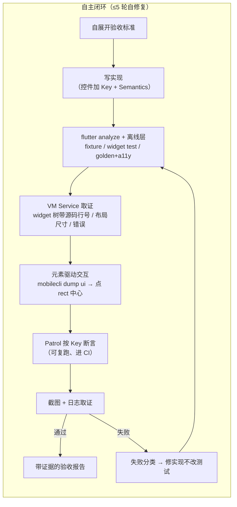

# flutter-autonomous

> 一个 [Agent Skill](https://agentskills.io)，把 Claude Code 变成会自己跑真机的 Flutter 工程师：把 App 跑到**真机 / 模拟器**上，像人一样点屏幕、看结果，无人监督地跑完 **实现 → 测试 → 修复** 闭环 —— **iOS 与 Android 完全对等**。

[](https://skills.sh/z-chu/flutter-autonomous-skill)
[](LICENSE)
[](#平台支持)
[](https://code.claude.com/docs/en/skills)

**[English README →](README.md)**

---

## 为什么需要它

所有 AI 编程助手在 Flutter 上都会撞同一堵墙：Flutter 把界面画在 **Skia/Impeller canvas** 上，系统无障碍树**默认几乎是空的**。通用的手机自动化（"列出元素、点那个按钮"）看到的是一片空白，于是 AI 退化成对着截图猜坐标盲点 —— 慢、脆、还老点错。

这个 skill 固化了从真实无人值守运行中打磨出来的破局方法：

1. **代码里暴露 `Semantics` label** → `mobilecli dump ui` 立刻能列出每个控件 + **设备像素级坐标** → 精准点中心，不用猜。skill 把"控件列不出来"当**代码缺陷去修**，而不是降级盲点。
2. **用 Patrol 按 `Key` 断言**（走 Dart VM）—— Flutter 上唯一不依赖无障碍树、iOS/Android 都稳、可复跑、能进 CI 的确定性断言路径。
3. **纯逻辑先离线秒级验证**（fixture 单测）—— 设备时间只花在只有设备能证明的事上。

再加上让长时间无人值守真正跑得下去的工程经验：环境自举（缺工具自己装）、热重载纪律（`USR1`/`USR2` 信号，绝不动不动冷启动浪费几十分钟）、前台校验防串台、"执行了命令 ≠ 达到了结果"的证据文化、≤5 轮自修复上限 + 结构化卡住报告。

## 快速开始

### 第 1 步：安装 skill（三选一）

```bash
# A. skills CLI（社区标准安装器，支持 70+ agent；-g = 全局装到所有项目可用）
npx skills add z-chu/flutter-autonomous-skill -g

# B. 一行命令（自动 clone 仓库并软链到 ~/.claude/skills）
curl -fsSL https://raw.githubusercontent.com/z-chu/flutter-autonomous-skill/main/install.sh | bash

# C. 手动
git clone https://github.com/z-chu/flutter-autonomous-skill.git
cd flutter-autonomous-skill && bash install.sh
```

也可以作为 Claude Code 插件安装：

```
/plugin marketplace add z-chu/flutter-autonomous-skill
/plugin install flutter-autonomous@flutter-autonomous-skill
```

装完**重启 Claude Code**（启动时才会发现新 skill）。之后无需手动启用：只要你说出"把 App 跑到设备上验证 X"这类话，skill 会自动触发。

### 第 2 步：自举环境（每台电脑一次）

```bash
bash ~/.claude/skills/flutter-autonomous/scripts/bootstrap.sh
```

对每个依赖做「检测 → 缺则装 → 独立命令回验」，幂等可重复跑。Linux 上自动跳过 iOS 工具链、只跑 Android。装不了的会打印出精确的手动安装命令。

### 第 3 步：接入你的 Flutter 项目（每个项目一次）

```bash
bash ~/.claude/skills/flutter-autonomous/setup-project.sh /path/to/your/flutter-app
```

往你的项目里装：权限白名单 + 自动 format/analyze hook、5 个斜杠命令。**只往 `.claude/` 里写**，项目根一个文件都不动，开跑前也不需要你配置任何东西。**绝不覆盖已有文件** —— 冲突的会放在旁边等你手动合并。

### 第 4 步：开干

```
/spec  给设置页加深色模式开关          # 先展开验收标准，你确认后再动手
/ship  给设置页加深色模式开关          # 全自动：实现 → 验证 → 出报告
/verify                              # 按改动类型选最硬证据验证当前改动
/debug patrol 报 found 0 widgets     # 定位失败根因
/nightly <贴一份任务清单>             # 睡前贴清单，早上看报告
```

或者不用命令直接说：*"把 App 跑到模拟器上，检查登录失败的错误提示显示对不对。"*

## 小白从零上手（没用过 Claude Code 也能跑通）

<details>
<summary><b>点开看完整教程（约 10 分钟跑通）</b></summary>

**0. 前提**：一台 mac（或只测 Android 的 Linux）、装好了 [Flutter SDK](https://docs.flutter.dev/get-started/install)、有一个能 `flutter run` 跑起来的项目。

**1. 装 Claude Code**（Anthropic 官方 CLI，[官方文档](https://code.claude.com/docs/en/overview)）：

```bash
npm install -g @anthropic-ai/claude-code
claude          # 首次运行会引导你登录
```

**2. 装本 skill**：终端里跑

```bash
curl -fsSL https://raw.githubusercontent.com/z-chu/flutter-autonomous-skill/main/install.sh | bash
```

**3. 补齐工具链**（脚本自动装 mobilecli / patrol 等，缺啥装啥）：

```bash
bash ~/.claude/skills/flutter-autonomous/scripts/bootstrap.sh
```

**4. 接入你的项目**：

```bash
bash ~/.claude/skills/flutter-autonomous/setup-project.sh ~/你的flutter项目
```

**然后就可以开跑了，不用配任何东西**——包名、两端 id、入口 Claude 自己探，设备运行期现取。只有人才知道的事（日志锚点、工具链硬要求、项目特有红线、提交策略）直接在对话里说一句就行；想让它跨会话生效，再写进你自己的 `CLAUDE.md`。**要跑无人值守**（`/nightly`、`/schedule`）前建议先写下**项目特有红线**和**提交策略**——那时没人可问，AI 只按写下来的办。

**5. 连上一台设备**：启动一个 Android 模拟器 / iOS 模拟器，或用数据线插上真机（Android 要开 USB 调试）。

**6. 开始用**：

```bash
cd ~/你的flutter项目
claude
```

进入后直接输入，比如：

```
/ship 在设置页加一个深色模式开关，切换立即生效、重启后保留
```

然后看着它自己：展开验收标准 → 写代码（自动给控件加 Key + Semantics）→ 跑离线单测 → 把 App 装上设备点一遍 → 跑 Patrol 回归 → 截图给你看 → 出验收报告。第一次建议全程盯着看一遍（见 [references/scaling.md](skills/flutter-autonomous/references/scaling.md) 的"信任阶梯"），眼见为实之后再放手 `/nightly` 整晚跑。

</details>

## 工作原理



**验证分层** —— 先问「这必须上设备吗」，再选最硬的证据：

| | 层 | 证明什么 | 成本 |
|---|---|---|---|
| **离线** | ① 纯逻辑 fixture | 解析 / 数值 / 状态机 / 错误处理 | 秒级、**无设备** |
| **离线** | ② widget test | 控件交互、页面跳转、表单、条件渲染 | 秒级、**无设备** |
| **离线** | ③ golden 矩阵 + a11y guideline | 视觉回归（主题×字号）；可点控件有没有 label / 热区 / 对比度 | 秒级、**无设备** |
| 设备 | ④ VM Service 内省 | 控件在不在、**是哪行代码画的**、布局真实尺寸、这步报没报错 | 一行 curl，不用点 |
| 设备 | ⑤ 元素驱动交互 | 真机上的点击、跳转、数据展示（一次性） | 快、在设备上 |
| 设备 | ⑥ Patrol 按 `Key` | 可复跑回归断言，出 pass/fail 进 CI | 在设备上 |
| 设备 | ⑦ 日志取证 | 连接 / 状态机 / gating（比截图硬） | 取证 |

**主次别搞反**：④⑤⑥⑦ 才是这个 skill 存在的理由 —— 把 App 真跑起来、自己点、自己看。①②③ 的作用是**上设备前先筛掉不值得占用设备时间的东西**（纯逻辑 bug 不该花 30 分钟真机时间定位；反复跑的静态视觉回归交给 golden，它给的是 `0.32%, 3619px diff` 这种数字加一张只画变化区域的图）。

> **离线全绿 ≠ UI 没问题** —— 无头环境不经真实渲染管线。改了 UI 就必须上设备真跑并截图核验，skill 里把「拿离线测试绿了当 UI 验过了」列为头号反模式。
>
> 反过来也一样：**纯写单测不需要这个 skill**，直接 `flutter test` 就行 —— 杀鸡不用牛刀。

**一个交互底座。** iOS（WebDriverAgent / `xcrun simctl`）与 Android（`adb`）的差异全部被 [`mobilecli`](https://github.com/mobile-next/mobilecli) 抹平 —— 方法论写一遍，双端通用。平台细节见 [`references/ios.md`](skills/flutter-autonomous/references/ios.md) 与 [`references/android.md`](skills/flutter-autonomous/references/android.md)。

**硬规则，不靠感觉。** skill 自带 Always/Never 契约：绝不猜元素名（先检视再动手）、绝不改测试降标准来"通过"、绝不没回查就报完成、能自己修的绝不停下要人 —— 并且红线**默认禁止、你事先明确授权才做**：花真钱的操作（支付/转账/上链）、密钥或凭证操作、不可逆破坏；无人值守遇到未授权的直接跳过并标注「需授权」，绝不卡住等人。项目特有红线与授权例外在对话里说，或写进你自己的项目 CLAUDE.md。

## 仓库结构

```
skills/flutter-autonomous/
├── SKILL.md                 # Claude 加载的方法论本体（环境自举 / 元素驱动 /
│                            # 验证分层 / 失败决策树 / 硬原则）
├── scripts/
│   ├── bootstrap.sh         # 跨平台环境自举（幂等可重入）
│   └── tap-by-label.sh      # 一条命令按 Semantics label 点击 Flutter 控件
├── references/              # 按需加载，不占默认上下文（省 token）
│   ├── vm-service.md        # 从跑着的 App 内部取证：widget 树带源码行号 /
│   │                        # 布局真实尺寸 / 结构化错误 / 运行时读状态
│   ├── ios.md               # iOS 模拟器优先：simctl / WDA / provisioning / 确定性开关 / 收尾
│   ├── android.md           # adb 细节、日志窗口断言、关动画等确定性开关、性能指标、断网测试
│   ├── offline-test-layer.md# 无设备的三层：fixture 四策略 + widget test + golden/a11y
│   ├── tool-decision-tree.md# mobilecli / VM Service / mobile-mcp / mobilewright / Patrol 何时用哪个
│   └── scaling.md           # 信任阶梯、worktree 并行、整晚无人值守
├── templates/               # setup-project.sh 装进你项目的模板
│   └── .claude/             # 权限白名单、format/analyze hook、
│                            # /spec /ship /verify /debug /nightly 五个命令
├── zh/                      # SKILL.md + references + templates 的完整中文副本
│                            # （先改这里，再同步进上面的英文正本）
└── setup-project.sh         # 一条命令接入项目
```

skill 完全**项目无关、零配置**：包名与两端 id 自动探测，设备运行期现取。只有人才知道的（日志锚点、工具链硬要求、项目红线、提交策略）在对话里说，或写进你自己的 `CLAUDE.md` 让它跨会话生效。**对外分发的是英文正本**（顶层 `SKILL.md` / `references/` / `templates/`，也是 Claude 实际加载的那份）；`zh/` 是维护者的工作语言，改完中文再同步到英文。

## 平台支持

| 宿主机 | Android 模拟器 | Android 真机 | iOS 模拟器 | iOS 真机 |
|---|---|---|---|---|
| **macOS** | ✅ | ✅ adb | ✅ `xcrun simctl` | ✅ WDA + provisioning |
| **Linux** | ✅ | ✅ adb | —（无 iOS 工具链） | — |

**依赖** —— 必需：Flutter SDK、`mobilecli`、`patrol_cli`、node ≥22、`jq`；可选：`mobile-mcp`、`mobilewright`、`go-ios`。除 Flutter SDK 外全部由 `bootstrap.sh` 自动安装。

## 常见问题

<details>
<summary><b>它会不会不经我同意就 commit / push 代码？</b></summary>

不会。提交明确**不是本 skill 的职责**：开工前它会先问你的提交策略（干一点提交一点 / 干完统一提 / 不提交），然后照做。`/nightly` 永远不 push —— 早上你 review 后自己推。
</details>

<details>
<summary><b>无人值守安全吗？</b></summary>

红线采取**默认禁止、授权才做**：花真钱的操作（支付、转账、上链交易等）、密钥或凭证操作、不可逆破坏，除非你**事先明确授权**（本次指令，或写进项目 CLAUDE.md，写明允许哪类、什么范围，如「沙箱支付可下单」），否则一律不做；无人值守中遇到未授权的红线操作不会傻等你回复——跳过并在报告里标注「需授权」，继续下个任务。设备物理掉线则自救一次仍失败才停。你项目特有的红线（比如电商的真实下单、区块链的私钥助记词）说一句或写进项目 CLAUDE.md，skill 一并遵守。注意它的失效方向：**什么都不写时，四条红线全部照旧生效**——没有配置只会让 AI 更保守，不会更危险。其余（装工具、scaffold 测试、修失败）都是可逆操作，自主完成。建议按 [`references/scaling.md`](skills/flutter-autonomous/references/scaling.md) 的"信任阶梯"来：先盯一两次完整闭环，再逐级放手。
</details>

<details>
<summary><b>为什么不直接截图 + 猜坐标点？</b></summary>

盲点坐标换个分辨率、换个布局、换个语言就全废，而且每点一下都要走一轮"截图 → 推理"。暴露了 Semantics 的控件一次廉价调用就返回精确的设备像素 rect —— 顺便还把你 App 的无障碍体验做好了，真实用户同样受益。
</details>

<details>
<summary><b>会跟我现有的测试冲突吗？</b></summary>

不会。Patrol 用例放在标准的 `integration_test/`，离线单测放 `test/`，没有任何私有格式。skill 带来的是纪律（可交互控件加 Key、fixture 四策略），不是新框架。
</details>

<details>
<summary><b>token 消耗大吗？</b></summary>

skill 按「渐进披露」设计：常驻上下文的只有几十字的 description，SKILL.md 正文触发时才载入，五份 references 只在需要时按需读取。元素驱动交互用结构化 JSON 而非整屏截图，也显著省 token。
</details>

## 参与贡献

欢迎 Issue 和 PR。**英文是对外正本**——`skills/flutter-autonomous/SKILL.md` 及其 `references/`、`templates/` 才是 Claude 实际加载的那份；`zh/` 是维护者的工作语言，改动先落中文，再同步进英文。直接提英文 PR 完全欢迎，不必附带 `zh/` 改动——说一声即可，中文侧事后补齐。`SKILL.md` 保持 500 行内，深度内容进 `references/`。

提 PR 前跑一下镜像检查——「改完记得同步」是靠自觉的约定，而它已经悄悄失效过一次：英文用户拿到的是中文侧早已否定的行为，仓库里却看不出任何异常：

```bash
bash tools/check-mirror.sh              # 每个 zh/ 文件都有结构对齐的英文正本
bash tools/check-mirror.sh --diff main  # 本分支没有出现「只改一边」
```

## 许可

[MIT](LICENSE) © z-chu

致谢：[mobile-next/mobilecli](https://github.com/mobile-next/mobilecli)、[Patrol](https://patrol.leancode.co/)、[Agent Skills 开放标准](https://agentskills.io)。
