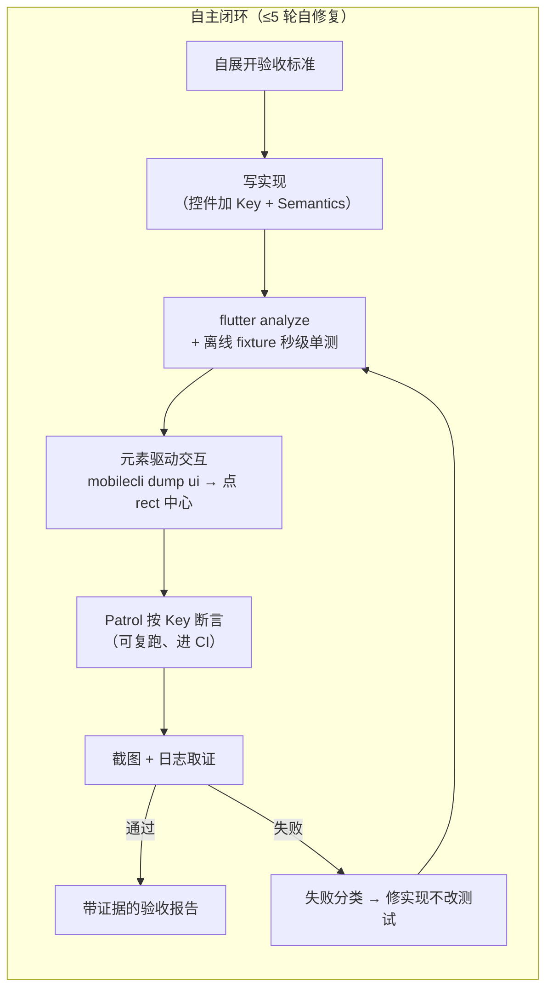

# flutter-autonomous

> 一个 [Agent Skill](https://agentskills.io)，把 Claude Code 变成会自己跑真机的 Flutter 工程师：把 App 跑到**真机 / 模拟器**上，像人一样点屏幕、看结果，无人监督地跑完 **实现 → 测试 → 修复** 闭环 —— **iOS 与 Android 完全对等**。

[](https://skills.sh/z-chu/flutter-autonomous-skill)
[](LICENSE)
[](#平台支持)
[](https://code.claude.com/docs/en/skills)

**[English README →](README.md)**

---

## 为什么需要它

所有 AI 编程助手在 Flutter 上都会撞同一堵墙：Flutter 把界面画在 **Skia/Impeller canvas** 上，系统无障碍树**默认几乎是空的**。通用的手机自动化（"列出元素、点那个按钮"）看到的是一片空白，于是 AI 退化成对着截图猜坐标盲点 —— 慢、脆、还老点错。

这个 skill 固化了从真实无人值守运行中打磨出来的破局方法：

1. **代码里暴露 `Semantics` label** → `mobilecli dump ui` 立刻能列出每个控件 + **设备像素级坐标** → 精准点中心，不用猜。skill 把"控件列不出来"当**代码缺陷去修**，而不是降级盲点。
2. **用 Patrol 按 `Key` 断言**（走 Dart VM）—— Flutter 上唯一不依赖无障碍树、iOS/Android 都稳、可复跑、能进 CI 的确定性断言路径。
3. **纯逻辑先离线秒级验证**（fixture 单测）—— 设备时间只花在只有设备能证明的事上。

再加上让长时间无人值守真正跑得下去的工程经验：环境自举（缺工具自己装）、热重载纪律（`USR1`/`USR2` 信号，绝不动不动冷启动浪费几十分钟）、前台校验防串台、"执行了命令 ≠ 达到了结果"的证据文化、≤5 轮自修复上限 + 结构化卡住报告。

## 快速开始

### 第 1 步：安装 skill（三选一）

```bash
# A. skills CLI（社区标准安装器，支持 70+ agent；-g = 全局装到所有项目可用）
npx skills add z-chu/flutter-autonomous-skill -g

# B. 一行命令（自动 clone 仓库并软链到 ~/.claude/skills）
curl -fsSL https://raw.githubusercontent.com/z-chu/flutter-autonomous-skill/main/install.sh | bash

# C. 手动
git clone https://github.com/z-chu/flutter-autonomous-skill.git
cd flutter-autonomous-skill && bash install.sh
```

也可以作为 Claude Code 插件安装：

```
/plugin marketplace add z-chu/flutter-autonomous-skill
/plugin install flutter-autonomous@flutter-autonomous-skill
```

装完**重启 Claude Code**（启动时才会发现新 skill）。之后无需手动启用：只要你说出"把 App 跑到设备上验证 X"这类话，skill 会自动触发。

### 第 2 步：自举环境（每台电脑一次）

```bash
bash ~/.claude/skills/flutter-autonomous/scripts/bootstrap.sh
```

对每个依赖做「检测 → 缺则装 → 独立命令回验」，幂等可重复跑。Linux 上自动跳过 iOS 工具链、只跑 Android。装不了的会打印出精确的手动安装命令。

### 第 3 步：接入你的 Flutter 项目（每个项目一次）

```bash
bash ~/.claude/skills/flutter-autonomous/setup-project.sh /path/to/your/flutter-app
```

往你的项目里装：`CLAUDE.md` 项目宪法（applicationId / bundleId 自动探测回填）、权限白名单 + 自动 format/analyze hook、5 个斜杠命令。**绝不覆盖已有文件** —— 冲突的会放在旁边等你手动合并。

### 第 4 步：开干

```
/spec  给设置页加深色模式开关          # 先展开验收标准，你确认后再动手
/ship  给设置页加深色模式开关          # 全自动：实现 → 验证 → 出报告
/verify                              # 按改动类型选最硬证据验证当前改动
/debug patrol 报 found 0 widgets     # 定位失败根因
/nightly <贴一份任务清单>             # 睡前贴清单，早上看报告
```

或者不用命令直接说：*"把 App 跑到模拟器上，检查登录失败的错误提示显示对不对。"*

## 小白从零上手（没用过 Claude Code 也能跑通）

<details>
<summary><b>点开看完整教程（约 10 分钟跑通）</b></summary>

**0. 前提**：一台 mac（或只测 Android 的 Linux）、装好了 [Flutter SDK](https://docs.flutter.dev/get-started/install)、有一个能 `flutter run` 跑起来的项目。

**1. 装 Claude Code**（Anthropic 官方 CLI，[官方文档](https://code.claude.com/docs/en/overview)）：

```bash
npm install -g @anthropic-ai/claude-code
claude          # 首次运行会引导你登录
```

**2. 装本 skill**：终端里跑

```bash
curl -fsSL https://raw.githubusercontent.com/z-chu/flutter-autonomous-skill/main/install.sh | bash
```

**3. 补齐工具链**（脚本自动装 mobilecli / patrol 等，缺啥装啥）：

```bash
bash ~/.claude/skills/flutter-autonomous/scripts/bootstrap.sh
```

**4. 接入你的项目**：

```bash
bash ~/.claude/skills/flutter-autonomous/setup-project.sh ~/你的flutter项目
```

然后打开项目里新生成的 `CLAUDE.md`，把没被自动填上的 `{{...}}` 占位补一下（不会填的留着，Claude 会自动探测）。

**5. 连上一台设备**：启动一个 Android 模拟器 / iOS 模拟器，或用数据线插上真机（Android 要开 USB 调试）。

**6. 开始用**：

```bash
cd ~/你的flutter项目
claude
```

进入后直接输入，比如：

```
/ship 在设置页加一个深色模式开关，切换立即生效、重启后保留
```

然后看着它自己：展开验收标准 → 写代码（自动给控件加 Key + Semantics）→ 跑离线单测 → 把 App 装上设备点一遍 → 跑 Patrol 回归 → 截图给你看 → 出验收报告。第一次建议全程盯着看一遍（见 [references/scaling.md](skills/flutter-autonomous/references/scaling.md) 的"信任阶梯"），眼见为实之后再放手 `/nightly` 整晚跑。

</details>

## 工作原理



**验证四层** —— 按改动类型永远选最硬的证据：

| 层 | 证明什么 | 成本 |
|---|---|---|
| ① 离线 fixture 单测 | 纯逻辑：解析 / 数值 / 状态机 / 错误处理 | 秒级、无设备 |
| ② 元素驱动交互 | 点击、跳转、数据展示（一次性） | 快、在设备上 |
| ③ Patrol 按 `Key` | 可复跑回归断言，出 pass/fail 进 CI | 在设备上 |
| ④ 日志 & 截图 | 连接/状态机用日志（比截图硬）；视觉布局用截图 | 取证 |

**一个交互底座。** iOS（WebDriverAgent / `xcrun simctl`）与 Android（`adb`）的差异全部被 [`mobilecli`](https://github.com/mobile-next/mobilecli) 抹平 —— 方法论写一遍，双端通用。平台细节见 [`references/ios.md`](skills/flutter-autonomous/references/ios.md) 与 [`references/android.md`](skills/flutter-autonomous/references/android.md)。

**硬规则，不靠感觉。** skill 自带 Always/Never 契约：绝不猜元素名（先检视再动手）、绝不改测试降标准来"通过"、绝不没回查就报完成、能自己修的绝不停下要人 —— 并且四条红线永远停下：设备物理掉线、真金链上交易、私钥/密钥操作、不可逆破坏。

## 仓库结构

```
skills/flutter-autonomous/
├── SKILL.md                 # Claude 加载的方法论本体（环境自举 / 元素驱动 /
│                            # 验证四层 / 失败决策树 / 硬原则）
├── scripts/
│   ├── bootstrap.sh         # 跨平台环境自举（幂等可重入）
│   └── tap-by-label.sh      # 一条命令按 Semantics label 点击 Flutter 控件
├── references/              # 按需加载，不占默认上下文（省 token）
│   ├── ios.md               # iOS 模拟器优先：simctl / WDA / provisioning / 收尾
│   ├── android.md           # adb 细节、日志取证、断网测试与恢复
│   ├── offline-test-layer.md# 离线秒级单测的四种 fixture 策略
│   ├── tool-decision-tree.md# mobilecli / mobile-mcp / mobilewright / Patrol 何时用哪个
│   └── scaling.md           # 信任阶梯、worktree 并行、整晚无人值守
├── templates/               # setup-project.sh 装进你项目的模板
│   ├── CLAUDE.md            # 项目宪法（{{占位}} 自动探测回填）
│   └── .claude/             # 权限白名单、format/analyze hook、
│                            # /spec /ship /verify /debug /nightly 五个命令
├── en/                      # SKILL.md + references + templates 的完整英文镜像
└── setup-project.sh         # 一条命令接入项目
```

skill 完全**项目无关**：包名、设备、dart-define、日志锚点、业务红线一律不写死 —— 自动探测或从你项目的 `CLAUDE.md` 读。中文是 source of truth，`en/` 镜像随中文同步。

## 平台支持

| 宿主机 | Android 模拟器 | Android 真机 | iOS 模拟器 | iOS 真机 |
|---|---|---|---|---|
| **macOS** | ✅ | ✅ adb | ✅ `xcrun simctl` | ✅ WDA + provisioning |
| **Linux** | ✅ | ✅ adb | —（无 iOS 工具链） | — |

**依赖** —— 必需：Flutter SDK、`mobilecli`、`patrol_cli`、node ≥22、`jq`；可选：`mobile-mcp`、`mobilewright`、`go-ios`。除 Flutter SDK 外全部由 `bootstrap.sh` 自动安装。

## 常见问题

<details>
<summary><b>它会不会不经我同意就 commit / push 代码？</b></summary>

不会。提交明确**不是本 skill 的职责**：开工前它会先问你的提交策略（干一点提交一点 / 干完统一提 / 不提交），然后照做。`/nightly` 永远不 push —— 早上你 review 后自己推。
</details>

<details>
<summary><b>无人值守安全吗？</b></summary>

skill 有四条硬红线，命中永远停下等人：设备物理掉线、真金/链上交易、私钥或密钥操作、不可逆破坏。其余（装工具、scaffold 测试、修失败）都是可逆操作，自主完成。建议按 [`references/scaling.md`](skills/flutter-autonomous/references/scaling.md) 的"信任阶梯"来：先盯一两次完整闭环，再逐级放手。
</details>

<details>
<summary><b>为什么不直接截图 + 猜坐标点？</b></summary>

盲点坐标换个分辨率、换个布局、换个语言就全废，而且每点一下都要走一轮"截图 → 推理"。暴露了 Semantics 的控件一次廉价调用就返回精确的设备像素 rect —— 顺便还把你 App 的无障碍体验做好了，真实用户同样受益。
</details>

<details>
<summary><b>会跟我现有的测试冲突吗？</b></summary>

不会。Patrol 用例放在标准的 `integration_test/`，离线单测放 `test/`，没有任何私有格式。skill 带来的是纪律（可交互控件加 Key、fixture 四策略），不是新框架。
</details>

<details>
<summary><b>token 消耗大吗？</b></summary>

skill 按「渐进披露」设计：常驻上下文的只有几十字的 description，SKILL.md 正文触发时才载入，五份 references 只在需要时按需读取。元素驱动交互用结构化 JSON 而非整屏截图，也显著省 token。
</details>

## 参与贡献

欢迎 Issue 和 PR。中文 `SKILL.md` 是 source of truth，改完同步 `en/` 镜像；`SKILL.md` 保持 500 行内，深度内容进 `references/`。

## 许可

[MIT](LICENSE) © z-chu

致谢：[mobile-next/mobilecli](https://github.com/mobile-next/mobilecli)、[Patrol](https://patrol.leancode.co/)、[Agent Skills 开放标准](https://agentskills.io)。
